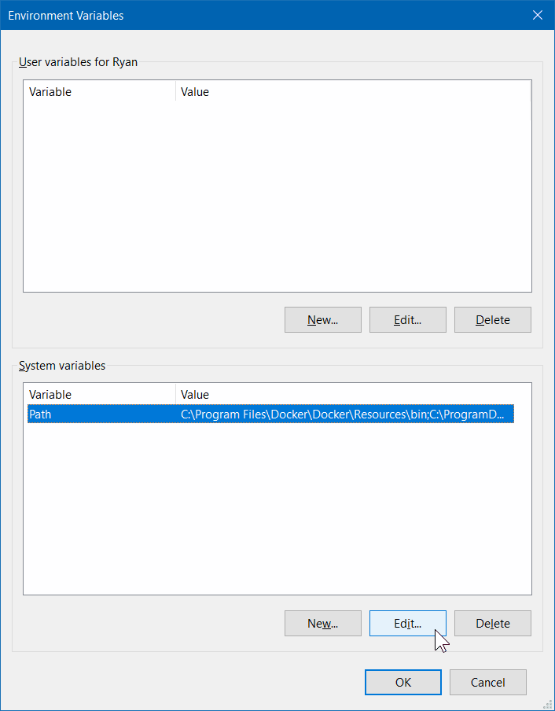

# KReyes Gourmet Cuisine 

## Description
KReyes Gourmet Cuisine  is an application project for a restaurant, which consists of a user interface to order their food, the same client can build the desired food, as long as it is a variety plate, once the food is requested, an order is created that goes up to the kitchen, and the client will be able to follow up step by step to the elaboration of his food, observing until the remaining times.

     
### General flow
                                           
* Client orders an item from the menu.
* Once the client pays for the order then the order is enqueue to the kitchen.
* The chef prepares the order for the client.
* Once the chef finishes, the order is removed from the queue.
* The restaurant can compute how much has been sold.

## Stack

* [Java](https://www.java.com/es/)
* [IntelliJ IDEA](https://www.jetbrains.com/idea/)
* [Git](https://git-scm.com/)

## Setup

This project is being developed in java and in order to start its development
the following steps should be taken:

As a requirement must have installed Windows 10 operating system.

1. Download and install [Java 11](https://www.oracle.com/java/technologies/javase-jdk11-downloads.html).

2. Set the path variable of JDk 11 in windows 10:
    * Open the Start Search, type in “env”, and choose “Edit the system environment variables”:

    

    * Click the “Environment Variables…” button.

    

    * In the part below select path and press the edit button.

    

    * Add the location of the bin folder of the JDK installation to the PATH variable in System Variables then press ok.

    

3. Download and install the Community version of [IntelliJ IDEA](https://www.jetbrains.com/es-es/idea/download/#section=windows).

4. Download and install [GIT](https://git-scm.com/).
5. Setup you git credentials in the terminal:

    `git config user.name" [Name] [Last Name] "`
    
    `git config user.email" [Email] "`

6. It is recommended to use a project repository for better management such as:
    * [Github](https://github.com/)
    
    * [Bitbucket](https://bitbucket.org/)

7. Enjoy it!

## Project Structure

This project is divided into several sections to keep a better work flow, the following basic entities are sectioned for the main routines:

### Entities
**Cashier** is the user that manage the accounting operations.

**Chef** is the user that prepare the items to sell and updates the status of the same. 

**Client** is the application user that make an order.

**Employee**is an user type that generate a code for employee.

**FinalProduct** is a product prepared, ready to deliver. 

**MeasureUnit** is one of the tool use to keep control of item quantity.

**Menu** is the list of all available items to sell.

**MenuItem** is an item to be sold within a menu.

**Order** is the  items to sell request.

**OrderDetail** contains all detail that the client ordered.

**Product** is a list of products that can be prepared.

**Stock** it handle the availability of a product.

**StockProduct** is the detailed product from the stock.

**User** is the general entity of any user.

